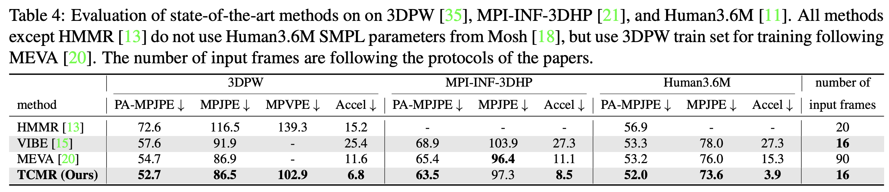
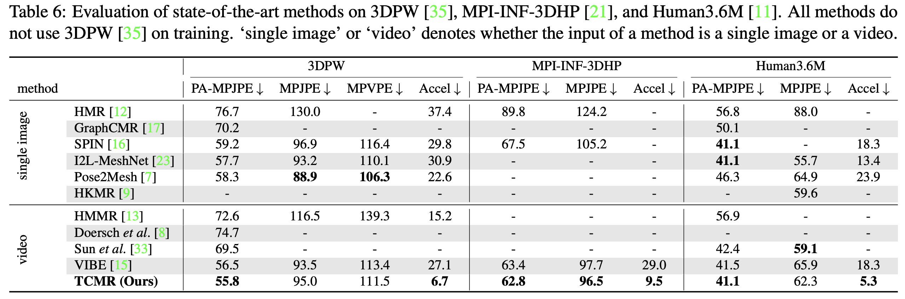

# TCMR: Beyond Static Features for Temporally Consistent 3D Human Pose and Shape from a Video
| Qualtitative result  | Paper teaser video |
| ------------- | ------------- |
|  |  |


## News
- Update 22.06.17: Now you can reproduce Table 6! No change on running commands. 
- Update 22.06.06: [NeuralAnnot](https://arxiv.org/abs/2011.11232) SMPL annotations of [Human36M](http://vision.imar.ro/human3.6m/description.php) are released!

## Introduction
This repository is the official [Pytorch](https://pytorch.org/) implementation of [Beyond Static Features for Temporally Consistent 3D Human Pose and Shape from a Video](https://arxiv.org/abs/2011.08627). 
Find more qualitative results [here](https://youtu.be/WB3nTnSQDII).
The base codes are largely borrowed from [VIBE](https://github.com/mkocabas/VIBE).

## Installation
TCMR is tested on Ubuntu 20.04 with Pytorch 1.12 + CUDA 11.3 and Python 3.9. 
Previously, it was tested on Ubuntu 16.04 with Pytorch 1.4 and Python 3.7.10. 
You may need sudo privilege for the installation.
```bash
source scripts/install_pip.sh
```
If you have a problem related to `torchgeometry`, please check [this](https://github.com/mks0601/I2L-MeshNet_RELEASE/issues/6#issuecomment-675152527) out.

## Quick demo
- Download the pre-trained demo TCMR and required data by below command and download SMPL layers from [here](https://smpl.is.tue.mpg.de) (male&female) and [here](http://smplify.is.tue.mpg.de) (neutral). Put SMPL layers (pkl files) under `${ROOT}/data/base_data/`.
```bash
source scripts/get_base_data.sh
```
- Run demo with options (e.g. render on plain background). See more option details in bottom lines of `demo.py`.
- A video overlayed with rendered meshes will be saved in `${ROOT}/output/demo_output/`. 
```bash
python demo.py --vid_file demo.mp4 --gpu 0 
```

## Results
Here I report the performance of TCMR.





See [our paper](https://arxiv.org/abs/2011.08627) for more details.

## Running TCMR

Download pre-processed data (except InstaVariety dataset) from [here](https://drive.google.com/drive/folders/1h0FxBGLqsxNvUL0J43WkTxp7WgYIBLy-?usp=sharing).
Pre-processed InstaVariety is uploaded by VIBE authors [here](https://owncloud.tuebingen.mpg.de/index.php/s/MKLnHtPjwn24y9C).
You may also download datasets from sources and pre-process yourself. Refer to [this](asset/data.md).
Put SMPL layers (pkl files) under `${ROOT}/data/base_data/`.

The data directory structure should follow the below hierarchy.
```
${ROOT}  
|-- data  
|   |-- base_data  
|   |-- preprocessed_data  
|   |-- pretrained_models
```

### Evaluation

- Download pre-trained TCMR weights from [here](https://drive.google.com/drive/folders/1NxzmKw5QTGtOKgSQetkq66ZO-dbBSzrd?usp=sharing).  
- Run the evaluation code with a corresponding config file to reproduce the performance in the tables of [our paper](https://arxiv.org/abs/2011.08627).
```bash
# dataset: 3dpw, mpii3d, h36m 
python evaluate.py --dataset 3dpw --cfg ./configs/repr_table4_3dpw_model.yaml --gpu 0 
```
- You may test options such as average filtering and rendering. See the bottom lines of `${ROOT}/lib/core/config.py`.
- We checked rendering results of TCMR on 3DPW validation and test sets.

### Reproduction (Training)

- Run the training code with a corresponding config file to reproduce the performance in the tables of [our paper](https://arxiv.org/abs/2011.08627).
- There is a [hard coding](https://github.com/hongsukchoi/TCMR_RELEASE/blob/46462c664f1057fb3c14e2049a377e6bc071d622/lib/dataset/_dataset_3d.py#L92) related to the config file's name. Please use the exact config file to reproduce, instead of changing the content of the default config file.
```bash
# training outputs are saved in `experiments` directory
# mkdir experiments
python train.py --cfg ./configs/repr_table4_3dpw_model.yaml --gpu 0 
```
- After the training, the checkpoints are saved in `${ROOT}/experiments/{date_of_training}/`. Change the config file's `TRAIN.PRETRAINED` with the checkpoint path (either `checkpoint.pth.tar` or `model_best.pth.tar`) and follow the evaluation command.
- You may test the motion discriminator introduced in VIBE by uncommenting the codes that have `exclude motion discriminator` notations.


## Reference
```
@InProceedings{choi2020beyond,
  title={Beyond Static Features for Temporally Consistent 3D Human Pose and Shape from a Video},
  author={Choi, Hongsuk and Moon, Gyeongsik and Chang, Ju Yong and Lee, Kyoung Mu},
  booktitle = {Conference on Computer Vision and Pattern Recognition (CVPR)}
  year={2021}
}
```

## License
This project is licensed under the terms of the MIT license.

### Related Projects

[I2L-MeshNet_RELEASE](https://github.com/mks0601/I2L-MeshNet_RELEASE)  
[3DCrowdNet_RELEASE](https://github.com/hongsukchoi/3DCrowdNet_RELEASE)  
[TCMR_RELEASE](https://github.com/hongsukchoi/TCMR_RELEASE)  
[Hand4Whole_RELEASE](https://github.com/mks0601/Hand4Whole_RELEASE)  
[HandOccNet](https://github.com/namepllet/HandOccNet)  
[NeuralAnnot_RELEASE](https://github.com/mks0601/NeuralAnnot_RELEASE)